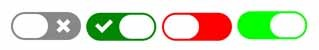

# React Toggle Slider Switch

A customizable react toggle slider switch component. Simple to use with built-in label functionality and customization options.

# Installation

To install the package, run:

**Using npm**:

```bash

npm install react-toggle-slider-switch

```

```bash

yarn add react-toggle-slider-switch

```
# Screenshot



# Basic Usage

Here’s a basic example using a functional component with the `ReactToggleSliderSwitch`:

**Copy code**:

```typescript
import React, { useState } from "react";
import ReactToggleSliderSwitch from "react-toggle-slider-switch";

const BasicExample: React.FC = () => {
  const [checked, setChecked] = useState<boolean>(false);

  const handleChange = (newChecked: boolean): void => {
    setChecked(newChecked);
  };

  return (
    <ReactToggleSliderSwitch
      checked={checked}
      onChange={handleChange}
      onColor="#22c55e"
      offColor="#d1d5db"
      handleDiameter={28}
      height={28}
      width={70}
    />
  );
};

export default BasicExample;

```

# Label Example 

Here’s a custom example with additional styles, using the `ReactToggleSliderSwitch` component:

**Copy code**:

```typescript

import React from "react";
import ReactToggleSliderSwitch from "react-toggle-slider-switch";

const LabelExample: React.FC = () => {

  const handleChange = (newChecked: boolean): void => {
    setChecked(newChecked);
  };

  return (
    <ReactToggleSliderSwitch
      label="Label"
      checked={checked}
      onChange={handleChange}
      onColor="#22c55e"
      offColor="#d1d5db"
      handleDiameter={28}
      height={28}
      width={70}
    />
  );
};

export default LabelExample;

```

# Custom Example 

Here’s an custom example with label using a functional component with the `ReactToggleSliderSwitch`:

**Copy code**:

```typescript

import React from "react";
import ReactToggleSliderSwitch from "react-toggle-slider-switch";

const CustomExample: React.FC = () => {
  const [checked, setChecked] = useState<boolean>(initialChecked);

  const handleChange = (newChecked: boolean): void => {
    setChecked(newChecked);
  };

  return (
    <ReactToggleSliderSwitch
      label="Custom Label"
      checked={isChecked}
      onChange={handleChange}
      onColor="#0f0"
      offColor="#f00"
      handleDiameter={28}
      height={28}
      width={70}
      switchBgClassName="custom-bg-class"
      switchHandleClassName="custom-handle-class"
      checkedIconStyle={{ color: "blue" }}
      uncheckedIconStyle={{ color: "red" }}
      labelStyle={{ fontWeight: "bold", fontSize: "14px" }}
    />
  );
};

export default CustomExample;

```

# Features

Customizable colors : Change the on and off switch colors.

Built-in label support : Automatically handles labels if you need one.

Drag & Click Behavior : You can click or drag to toggle the switch.

Custom icons : Supports custom icons for both checked and unchecked states.

# Props

| Prop                   | Type                                       | Default                | Description                                                                                           |
|------------------------|--------------------------------------------|------------------------|-------------------------------------------------------------------------------------------------------|
| `checked`              | `boolean`                                  | Required               | The checked state of the switch. If true, the switch is set to checked.                               |
| `onChange`             | `(checked: boolean, event: Event, id?: string) => void` | Required               | Callback invoked when the user clicks or drags the switch. `checked` indicates the future state.       |
| `disabled`             | `boolean`                                  | `false`                | When true, the switch is non-interactive, and its colors are greyed out.                              |
| `offColor`             | `string`                                   | `"#d1d5db"`            | The color of the switch when it is not checked. Accepts hex values (e.g., #888, #45abcd).             |
| `onColor`              | `string`                                   | `"#22c55e"`            | The color of the switch when it is checked. Accepts hex values (e.g., #080, #45abcd).                 |
| `offHandleColor`       | `string`                                   | `"#fff"`               | The color of the handle when the switch is not checked. Accepts hex values (e.g., #fff, #45abcd).      |
| `onHandleColor`        | `string`                                   | `"#fff"`               | The color of the handle when the switch is checked. Accepts hex values (e.g., #fff, #45abcd).          |
| `outline`              | `boolean`                                  | `undefined`            | Specifies if the handle should have an outline when focused.                                          |
| `handleWidth`          | `number`                                   | `35`                   | The width of the handle, measured in pixels.                                                          |
| `label`                | `string`                                   | `undefined`            | The label to display alongside the switch.                                                            |
| `labelPosition`        | `"before" \| "after"`                      | `"after"`              | Position of the label if the label is defined.                                                        |
| `labelStyle`           | `React.CSSProperties`                      | `undefined`            | Custom styles for the label (e.g., fontSize, color, etc.).                                            |
| `handleDiameter`       | `number`                                   | `undefined`            | Diameter of the handle, measured in pixels.                                                           |
| `uncheckedHandleIcon`  | `JSX.Element`                              | `undefined`            | Custom icon to display on the handle when the switch is not checked.                                  |
| `checkedHandleIcon`    | `JSX.Element`                              | `undefined`            | Custom icon to display on the handle when the switch is checked.                                      |
| `uncheckedIcon`        | `boolean \| JSX.Element`                   | `defaultUncheckedIcon` | Icon that will be shown when the switch is not checked. Set to false to show no icon.                 |
| `checkedIcon`          | `boolean \| JSX.Element`                   | `defaultCheckedIcon`   | Icon that will be shown when the switch is checked. Set to false to show no icon.                     |
| `boxShadow`            | `string \| null`                           | `undefined`            | Box-shadow of the handle of the switch.                                                               |
| `activeBoxShadow`      | `string`                                   | `"0px 0px 2px 2px #3bf"` | Box-shadow of the handle when focused or active.                                                      |
| `height`               | `number`                                   | `28`                   | Height of the switch background in pixels.                                                            |
| `width`                | `number`                                   | `70`                   | Width of the switch background in pixels.                                                             |
| `borderRadius`         | `number`                                   | `undefined`            | Border radius of the switch and handle.                                                               |
| `className`            | `string`                                   | `undefined`            | Custom className for the outer shell of the switch.                                                   |
| `id`                   | `string`                                   | `undefined`            | ID of the embedded checkbox.                                                                          |
| `switchBgClassName`     | `string`                                   | `""`                   | Custom className for the switch background.                                                           |
| `switchHandleClassName` | `string`                                   | `""`                   | Custom className for the switch handle.                                                               |
| `checkedIconClassName`  | `string`                                   | `""`                   | Custom className for the checked icon.                                                                |
| `uncheckedIconClassName`| `string`                                   | `""`                   | Custom className for the unchecked icon.                                                              |
| `checkedIconStyle`     | `React.CSSProperties`                      | `undefined`            | Custom styles for the checked icon.                                                                   |
| `uncheckedIconStyle`   | `React.CSSProperties`                      | `undefined`            | Custom styles for the unchecked icon.                                                                 |


# Development

You're welcome to contribute to react-toggle-switch. Keep in mind that big changes have to be thoroughly tested on different browsers and devices before they can be merged.

To set up the project:

Fork and clone the repository

Install dependencies:

```bash

npm install

```

Run the development server:

```bash

npm run dev

```

# License

This project is licensed under the MIT License.